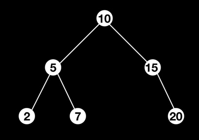

# PF1 Project


## Binary Search Tree traversal algorithm visualisation 

Authors: Michele Cattaneo, Davide Scannapieco

##### What does this program do

This program provides the user a graphical interface displaying a visualisation of one or more Binary Search Tree(s). On any Binary Search Tree the user has three different algorithms to choose from, execute and visualise step-by-step: 

- Pre-order Traversal
- In-order Traversal
- Post-order Traversal

Having chosen an algorithm to execute, the user can go step-by-step deep inside the corresponding traversal of the chosen algorithm. At the beginning each node is coloured in grey, meaning that that node has not yet been nor visited nor marked. 
When a node is visited, is turned red and when a node is marked is turned green.
The difference between a red node and a green one stands in the algorithm chosen. Some nodes are only used to get to the next node to be marked and therefore are marked in red. The node sequence resulting from the algorithm are turned green in the corresponding order. For example the In-order algorithm marks the nodes ( in a Binary Search Tree with the invariant that everything on the left is smaller than everything on the right ) in ascending order, therefore with that algorithm selected, all nodes will be turned green from the smaller to the higher value.


##### How to give other trees as input

This project contains a CSV file named multiple.csv. This file contains multiple rows of comma separated numbers and each of these rows represents a different BST. Change these trees the user is required to change the content of that file. If the user wants to change the file with a new one it is required to change the path of the source file inside the project.rkt file. To find the place where the file is read, search for the function 

```scheme
(read-csv-file "multiple.csv")
```

and change the content inside the double quotes with the desired csv file relative p. Note that that file is read in 2 different places, a few lines apart one to another. 
The order of these numbers inside the csv file has to follow this template:
The tree is constructed backwards, meaning that the root of the whole tree is the last given number of the row then the number on the left of it is inserted in the tree made by this single number, the number on the left of it is inserted in the tree made by the other two and so on.
For a given tree, converting it in a row of number is done by putting each number, starting from the lower level from the left to the right going up to the next level up until the last level ( the root node ).
For example this BST 



is obtained by the input: 2, 7, 20, 5, 15, 10

##### How to run the program

- If you have DrRacket installed:
  Open the file project.rkt with DrRacket, execute it ( cmd+R ) and type the following function in the interaction area

  ```scheme
  (main 0)
  ```
  
  A new windows with the graphical interface will be opened.
  
  This new windows will show the first tree given as input by default. If more than one tree is given, it is possible to go through them with the right-arrow key. The key used to perform a step of the algorithm is the down-arrow key.
  To change algorithm to perform the following number key are linked:
  1 for Post-order, 2 for In-order and 3 for Pre-order.

##### The software

This software consists in 2 files:
A racket file containing the code and a csv file containing the inputs.
The csv file simply contains rows of comma separated numbers representing one or more binary search trees ( one per row ). 
The can be divided into these sections:

- Read the csv file and a number of functions to create BTSs from a list of numbers, search for numbers inside a BST.

- Handle the algorithms; depending on the algorithm chosen to be displayed the program needs a list of consecutive nodes being visited at each step in order to assign the correct color to every node at each step.

- Handle the actions; depending on the action requested the program needs to have a new application with the applications parameters being changed, for example when a new step of the algorithm is requested the new application need to increase the iterator ( which holds the current number of steps ) and have a new tree with a new node being coloured. When is requested to display a new tree, the new application needs to have the new tree as a parameter ( for that new tree all node parameters like the position coordinates have to be newly computed ).

- Visualise the animations: Eveytime and action is done, a new application with new parameters is created and drawn. For each tree the coordinates of each node is computed such that, for any node, its left-subtree is all contained inside its left part of the screen and its right-subtree is all contained inside its right part of the screen. Additionally for each tree the depth of each level is computed such that all level are visible inside the screen, depending on  how the tree is given. Furthermore for each tree the radius of its nodes is computed such that: the radius is computed such that the lowest level, if it was full of nodes, would not have nodes touching each other, but if that radius would be bigger than the depth of a level divided by 2 ( hence 2 nodes would touch on the bottom and top part ), the radius is set to be such depth divided by two.

  


 

